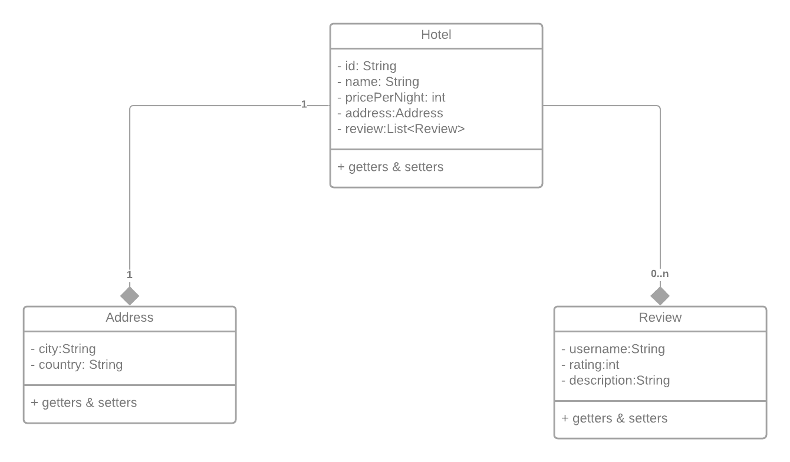

# hotel-api

Hotel API developed using Spring Boot.

## Stack
- *Spring Boot*: All the dependencies used in this project can be found in the pom.xml
- MongoDB

## Endpoints

> /api/v1/hotel
- GET
- POST
- PUT (/hotelId)
- DELETE (/hotelId)

> api/v1/hotel/review
- POST (/hotelId)

## Diagram

## Resources

Diagram: [Create a Spring Boot Application Using MongoDB Intermediate Spring Boot](https://www.youtube.com/watch?v=Hu-cyytqfp8)
